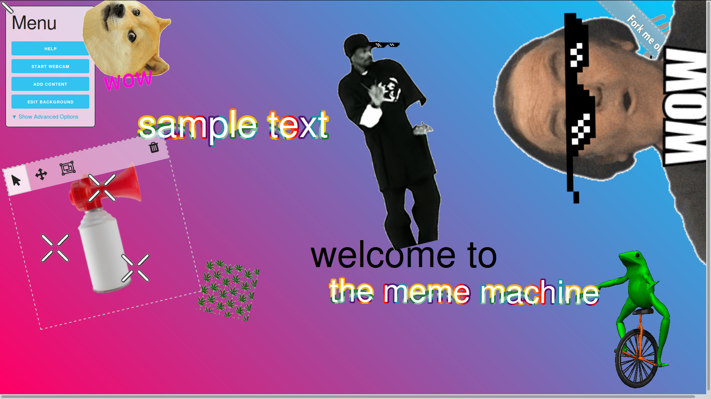

# The Meme Machine

*Welcome to the next era of the internet. This software will change your life. A new dawn of dank memes awaits us. Are you ready?*

For years we have relied on proprietary software like Photoshop, Flash, and Premiere to create stupid internet videos. This project puts an end to all that. No longer do we have to let  big software companies  control the free exchange of memes on our internet.

## Installation

You can use this software from the comfort of your browser without installing anything by visiting https://majorleague.website

Alternatively, if you are a nerd, you can clone this repository and run it from your computer by following these instructions:

- Clone / download this project
- ```npm install```
- ```gulp```
- Open the ```public/index.html``` file in your browser

There is a known bug which prevents font icons from appearing in Firefox when loading the project locally. To avoid this, you can run a webserver on your computer and set the ```public``` folder as your document root. 

## Screenshots


